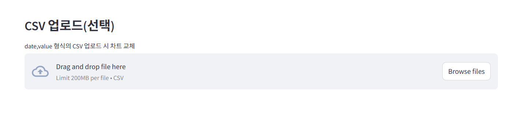

# 미니 ML 대시보드



이 프로젝트는 다양한 머신러닝 모델을 탐색하고, 하이퍼파라미터 튜닝을 수행하며, 모델 성능을 평가하기 위한 Streamlit 기반의 인터랙티브 대시보드를 제공합니다. Iris 데이터셋을 사용하여 다양한 ML 알고리즘을 빠르게 실험할 수 있는 미니 도구로 설계되었습니다.

## 기능

- **모델 선택:** 로지스틱 회귀, 랜덤 포레스트, 서포트 벡터 분류기(SVC), K-최근접 이웃(KNN), 그래디언트 부스팅, XGBoost, 배깅, 스태킹을 포함한 다양한 분류 모델 중에서 선택할 수 있습니다.
- **하이퍼파라미터 튜닝:** UI를 통해 모델 파라미터를 직접 구성할 수 있습니다.
- **교차 검증 및 홀드아웃 평가:** K-겹 교차 검증 및 홀드아웃 테스트 세트를 사용하여 모델 성능을 평가합니다.
- **하이퍼파라미터 탐색:** 자동화된 하이퍼파라미터 최적화를 위해 Grid Search 및 Random Search를 활용합니다.
- **AutoML (Optuna 통합):** Optuna를 활용하여 고급 자동화된 머신러닝을 수행하고, 여러 후보 모델에서 최적의 모델과 하이퍼파라미터를 찾습니다.
- **모델 비교:** 여러 모델의 성능을 나란히 비교합니다.
- **실시간 예측:** 학습된 모델을 사용하여 단일 데이터 샘플에 대한 예측을 수행합니다.
- **학습 로그:** 학습 및 최적화 실행 기록을 확인하고 다운로드할 수 있습니다.

## 설치

이 애플리케이션을 로컬에서 실행하려면 다음 단계를 따르세요:

1.  **저장소 복제:**
    ```bash
    git clone https://github.com/your-username/mini-ml-dashboard.git
    cd mini-ml-dashboard
    ```

2.  **가상 환경 생성 (권장):**
    ```bash
    python -m venv venv
    # Windows
    .\venv\Scripts\activate
    # macOS/Linux
    source venv/bin/activate
    ```

3.  **의존성 설치:**
    ```bash
    pip install -r requirements.txt
    ```

## 사용법

Streamlit 애플리케이션을 시작하려면 다음을 실행하세요:

```bash
streamlit run app.py
```

애플리케이션이 웹 브라우저에서 열립니다. 대시보드와 상호 작용하여 모델을 선택하고, 파라미터를 조정하고, 학습하고, 평가하고, 예측을 수행할 수 있습니다.

## Docker

Docker를 사용하여 이 애플리케이션을 실행할 수도 있습니다:

1.  **Docker 이미지 빌드:**
    ```bash
    docker build -t mini-ml-dashboard .
    ```

2.  **Docker 컨테이너 실행:**
    ```bash
    docker run -p 8501:8501 mini-ml-dashboard
    ```
    그런 다음, 웹 브라우저를 열고 `http://localhost:8501`으로 이동하세요.

## 사용된 기술

-   [Streamlit](https://streamlit.io/) - 인터랙티브 웹 애플리케이션 구축용.
-   [Scikit-learn](https://scikit-learn.org/stable/) - 머신러닝 모델 및 유틸리티용.
-   [XGBoost](https://xgboost.readthedocs.io/) - 그래디언트 부스팅 라이브러리.
-   [Optuna](https://optuna.org/) - 하이퍼파라미터 최적화 프레임워크.
-   [Pandas](https://pandas.pydata.org/) - 데이터 조작 및 분석.
-   [NumPy](https://numpy.org/) - 수치 계산.
-   [Matplotlib](https://matplotlib.org/) & [Seaborn](https://seaborn.pydata.org/) - 데이터 시각화.