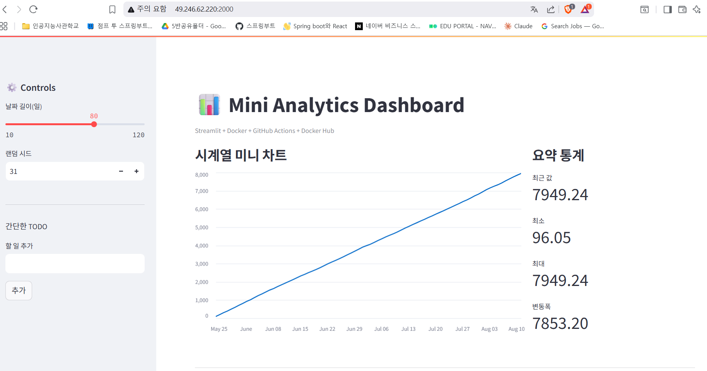
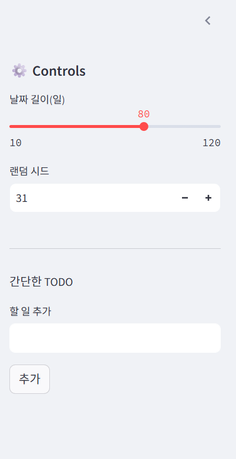

# 📊 Mini Analytics Dashboard


간단하고 가벼운 **데이터 분석 대시보드** 🖥  
`Streamlit + Docker + GitHub Actions + Docker Hub`로 배포되는 풀스택 미니 프로젝트입니다.

---

## 🚀 기능
- 시계열 더미 데이터 생성 및 시각화
- 날짜/시드 값 조절 가능
- 업로드한 CSV 데이터로 차트 교체
- 간단한 TODO 리스트
- Docker 이미지로 어디서든 실행 가능

---

## 🖼 실행 화면

### 메인 차트


### 사이드바 옵션


### CSV 업로드 예시


---

## 🛠 설치 및 실행

### 1. Docker Hub 이미지로 바로 실행
```bash
docker run --rm -p 8501:8501 <YOUR_DOCKERHUB_USERNAME>/mini-analytics-dashboard:latest
